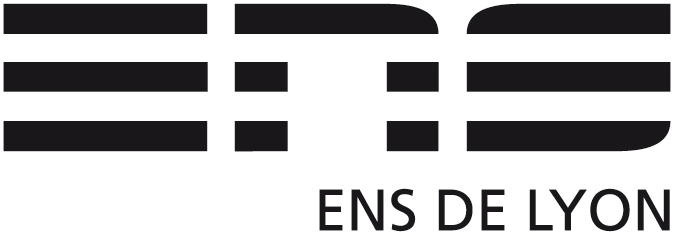

# cap-labs 2021: Public files for ENSL M1 students (CAP course)



## [Planning, with links to slides, lab subjects, ...](PLANNING.md)

## Course

* Teachers:
  - Gabriel Radanne, Inria, LIP https://gabriel.radanne.net/
  - Ludovic Henrio, CNRS, LIP https://lhenrio.github.io/

* Visio (for co-modal): https://webconference2.ens-lyon.fr/b/gab-by3-zmw-11m
* Page on the "portail des études ENSL" : https://etudes.ens-lyon.fr/course/view.php?id=5249
* Discord Channel: https://discord.com/channels/691214205692542976/771392543853117460
* Previous year's video courses: https://www.youtube.com/playlist?list=PLtjm-n_Ts-J-6EU1WfVIWLhl1BUUR-Sqm

## Get the repository

```
git clone https://github.com/Drup/cap-lab22.git
cd cap-lab22
```

## Contents

   * TPxx/     : student companion files for CAP labs 2022-23

## About the target machine

The target machine is [RISCV](https://riscv.org/).
The directory contains [instructions](INSTALL.md) to install a compiler and a simulator.

## Contact

Gabriel Radanne, Inria, LIP [email](mailto:gabriel.radanne@ens-lyon.fr)

## Exam 

* MCC (final grade computation) : 
```
let ccgrade = average(Lab3, Lab5, Lab6, partial)
in (finalnote + ccgrade)/2
```
* The partial exam is this academic year replaced by a written housework ("DM").

* The final exam will be done "physically" in January. It will last three (3) hours. No authorized documents.

## Contributors

  * Labs (ENSL 2019 version): Laure Gonnord, Ludovic Henrio, Matthieu Moy, Marc de Vismes
  * 2020 : Gabriel Radanne, Paul Iannetta
  * 2021-2022 : Nicolas Chappe, Remi Di Guardia
